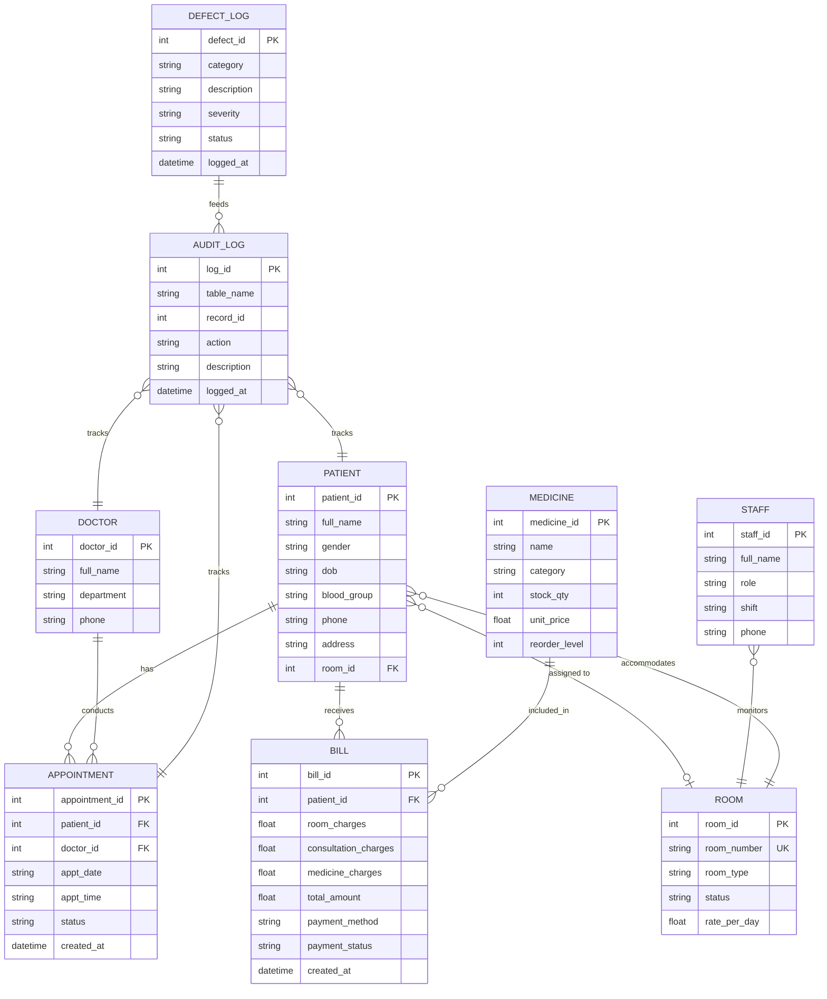

# ER Diagram

The logical data model for the Hospital Management System is shown below.

```mermaid
erDiagram
    PATIENT ||--o{ APPOINTMENT : has
    PATIENT ||--o{ BILL : receives
    PATIENT }o--o| ROOM : "assigned to"
    DOCTOR ||--o{ APPOINTMENT : conducts
    ROOM ||--o{ PATIENT : accommodates
    STAFF }o--|| ROOM : monitors
    MEDICINE ||--o{ BILL : included_in
    AUDIT_LOG }o--|| PATIENT : tracks
    AUDIT_LOG }o--|| DOCTOR : tracks
    AUDIT_LOG }o--|| APPOINTMENT : tracks
    DEFECT_LOG ||--o{ AUDIT_LOG : feeds

    PATIENT {
        int patient_id PK
        string full_name
        string gender
        string dob
        string blood_group
        string phone
        string address
        int room_id FK
    }

    DOCTOR {
        int doctor_id PK
        string full_name
        string department
        string phone
    }

    APPOINTMENT {
        int appointment_id PK
        int patient_id FK
        int doctor_id FK
        string appt_date
        string appt_time
        string status
        datetime created_at
    }

    ROOM {
        int room_id PK
        string room_number UK
        string room_type
        string status
        float rate_per_day
    }

    STAFF {
        int staff_id PK
        string full_name
        string role
        string shift
        string phone
    }

    MEDICINE {
        int medicine_id PK
        string name
        string category
        int stock_qty
        float unit_price
        int reorder_level
    }

    BILL {
        int bill_id PK
        int patient_id FK
        float room_charges
        float consultation_charges
        float medicine_charges
        float total_amount
        string payment_method
        string payment_status
        datetime created_at
    }

    AUDIT_LOG {
        int log_id PK
        string table_name
        int record_id
        string action
        string description
        datetime logged_at
    }

    DEFECT_LOG {
        int defect_id PK
        string category
        string description
        string severity
        string status
        datetime logged_at
    }
```
