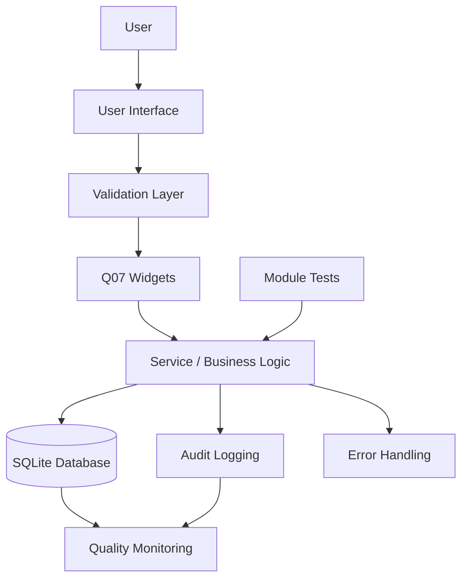

# System Architecture

## High-Level Flow



## Quality Control Flow

```text
User Action
    ↓
Input Masking (phone format enforced)
    ↓
Dropdown Validation (field constrained to valid list)
    ↓
Auto-Complete Check (duplicate patient surfaced before save)
    ↓
Confirmation Modal (destructive action confirmed)
    ↓
Database Transaction
    ↓
Audit Log Record (table, record_id, action, timestamp)
    ↓
Quality Metric

If a validation error occurs:
    ↓
Friendly error dialog shown
    ↓
No database write occurs
    ↓
Defect optionally logged to Checksheet
```

## Layer Separation

The system separates the user interface, validation widgets, data-access models and the database so that each Q07 feature is implemented once and reused across all modules rather than duplicated per form.

## Design Principle

Models never import Tkinter. Views never run raw SQL. Widgets are written once and imported where needed.
